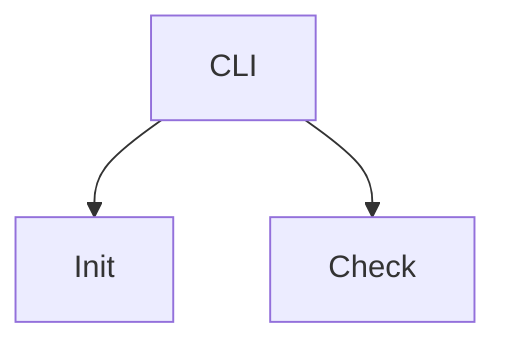

# ADR-002: Use Mermaid JS for diagrams

## Status

Accepted

## Context

The dotcontext standard encourages architecture diagrams and visual documentation inside `.context/`. We need to choose a diagram format that works well for both humans and AI agents.

Key requirements:
- AI-readable — agents (LLMs) must be able to understand and generate diagrams without external tools
- Git-friendly — diagrams should be diffable, reviewable in PRs, and merge-friendly
- No extra tooling — authors shouldn't need Figma, draw.io, or image editors
- Renderable — diagrams should render natively in GitHub, GitLab, and most markdown viewers

## Decision

Use **Mermaid JS** as the standard diagram format inside `.context/` documentation.

Diagrams are written as fenced code blocks in markdown:

````

````

## Alternatives Considered

**PlantUML**
- Pro: mature, supports many diagram types (sequence, class, component, etc.)
- Con: requires a Java runtime or external server to render
- Con: syntax is less intuitive than Mermaid for simple diagrams
- Con: not natively rendered by GitHub or most markdown viewers

**ASCII art**
- Pro: zero dependencies, universally readable
- Con: tedious to author and maintain, especially for complex diagrams
- Con: no structured syntax — AI agents must visually parse the layout

**Image files (PNG/SVG exports)**
- Pro: pixel-perfect rendering everywhere
- Con: not diffable in git — changes are opaque in pull requests
- Con: AI agents cannot read image content from markdown files
- Con: requires external tools to create and edit

## Consequences

- **AI-native** — Mermaid is plain text, so LLMs can read, generate, and modify diagrams directly
- **GitHub renders it** — Mermaid code blocks render as diagrams in GitHub markdown, READMEs, and PRs
- **Zero tooling** — authors write text, no installs required
- **Git-friendly** — diffs show exactly what changed in the diagram
- **Supported diagram types** — flowcharts, sequence diagrams, class diagrams, ER diagrams, Gantt charts, and more
- **Learning curve** — contributors need to learn Mermaid syntax, but it is minimal and well-documented
